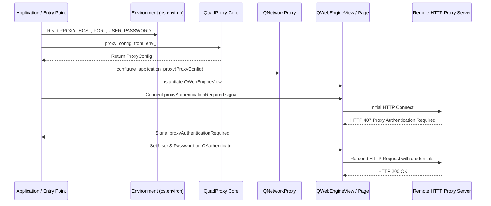

# Integration Guide — Embedding QuadProxy into PyQt Applications

This guide provides step-by-step instructions for architecture engineers and Python developers embedding QuadProxy into existing PyQt5 or PyQt6 applications.

---

## Architecture Overview

QuadProxy interacts with Qt's networking layer (`QNetworkProxy`) and WebEngine page layer (`QWebEnginePage`) to provide seamless proxy routing with credential authentication.



---

## Step 1: Pre-QApplication Proxy Setup

> [!CAUTION]
> **CRITICAL ORDERING REQUIREMENT:**  
> `configure_application_proxy()` MUST be executed **BEFORE** any `QWebEngineView` or network request is created, and preferably **BEFORE** `QApplication` instantiation.  
> Failing to set `QNetworkProxy.setApplicationProxy` before WebEngine process initialization will result in direct, unproxied connections or silent network failure!

### Recommended Integration Code Structure

In your application's entry point (`main.py` or `app.py`):

```python
import sys
from quadproxy import configure_application_proxy, proxy_config_from_env

def main():
    # Parse CLI flags (e.g. --no-proxy)
    no_proxy = "--no-proxy" in sys.argv

    # Step 1: Load environment variables
    config, onboarding_msg = proxy_config_from_env(no_proxy=no_proxy)

    if onboarding_msg:
        print(onboarding_msg)
        sys.exit(0)

    # Step 2: Set global application proxy
    configure_application_proxy(config)

    # Step 3: Initialize QApplication
    from PyQt6.QtWidgets import QApplication
    app = QApplication(sys.argv)

    # Launch main application window
    from my_app.gui import MainWindow
    window = MainWindow(proxy_config=config)
    window.show()

    sys.exit(app.exec())
```

---

## Step 2: Credential Handler Wiring

When a `QWebEngineView` connects through an authenticated HTTP proxy, Chromium issues a proxy authentication challenge. QuadProxy handles this challenge via the `proxyAuthenticationRequired` signal on `QWebEnginePage`.

### Attaching Callback to `QWebEngineView`

```python
from PyQt6.QtWebEngineWidgets import QWebEngineView
from PyQt6.QtCore import QUrl
from quadproxy import ProxyConfig

class ProxyBrowserWidget(QWebEngineView):
    def __init__(self, proxy_config: ProxyConfig | None, parent=None):
        super().__init__(parent)
        self.proxy_config = proxy_config

        if self.proxy_config is not None:
            self.page().proxyAuthenticationRequired.connect(self._handle_proxy_auth)

    def _handle_proxy_auth(self, request_url: QUrl, authenticator, proxy_host: str):
        if self.proxy_config:
            authenticator.setUser(self.proxy_config.user)
            authenticator.setPassword(self.proxy_config.password)
```

---

## Step 3: Preflight Verification Integration

Before navigating to sensitive business targets, use `ProxyCheckingWindow` or `verify_proxy_connection` to verify that your proxy is active and hiding your real public IP.

```python
from quadproxy.diagnostics import verify_proxy_connection, ProxyConnectionError

def verify_before_launch(proxy_config: ProxyConfig | None):
    """Run preflight network check before showing main GUI."""
    result = verify_proxy_connection(proxy_config, timeout=10.0)
    if result.get("status") != "ok":
        raise ProxyConnectionError(f"Preflight check failed: {result.get('message')}")

    print(f"Verified Proxy Public IP: {result.get('public_ip')}")
```

---

## Step 4: Multi-Tab & Multi-Window Applications

If your application creates multiple `QWebEngineView` tabs or secondary windows:

1. Global proxy settings (`configure_application_proxy`) apply globally to all Qt network sockets and Chromium WebEngine child processes.
2. Remember to connect `page().proxyAuthenticationRequired` on **every new `QWebEnginePage` or `QWebEngineView` instance** created at runtime.

```python
def create_new_tab(self, url_str: str):
    view = QWebEngineView()
    if self.proxy_config:
        view.page().proxyAuthenticationRequired.connect(self._handle_proxy_auth)
    view.setUrl(QUrl(url_str))
    self.tab_widget.addTab(view, "New Tab")
```

---

## Step 5: Handling Proxy Rotation & Dynamic Updates

If your proxy provider rotates IP addresses per request or per session:
- **Sticky IP Sessions**: Ensure your proxy provider credentials (or port) specify sticky sessions if stateful login sessions are required.
- **Endpoint or Credential Changes**: Restart the application after changing the
  configured proxy endpoint or credentials. Qt WebEngine consumes the
  application proxy at browser-process startup, so changing it in an already
  running process does not provide reliable rotation.
